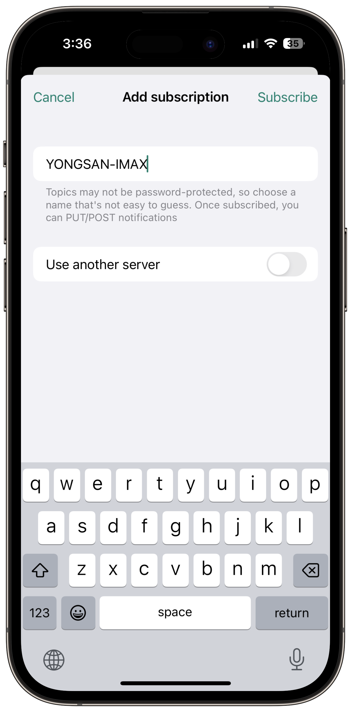
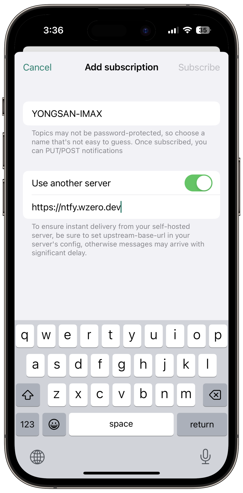
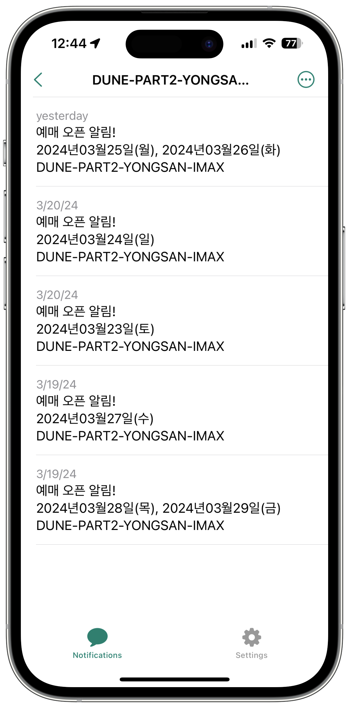

<div align="center">

# CGV 예매 오픈 알리미

<p align="center">
  
</p>

By_0w0i0n0g0

<br>
<br>

## [서버가 작동 중인지 여기서 확인하세요!](http://serverkorea.duckdns.org:5000)

###  http://serverkorea.duckdns.org:5000

<br>
<br>

## 📢 알림

CGV의 서버 쪽 제한으로 인해 최대 5분 간의 알림 지연이 생길 수 있습니다. 양해 부탁 드립니다.

<br>
<br>

## 목차

[알림 받기](#알림-받기)

[Description](#description)

[Features](#features)

[Stack](#stack)

[License](#license)

</div>

<br>
<br>

## 🔎 현재 예매 오픈 알리미가 지켜보고 있는 영화는? (2024/05/05 기준)

- 용아맥 예매 오픈 알리미 (베타)
- 극장판하이큐!!쓰레기장의결전 / 용산아이파크몰 / IMAX 관
- 혹성탈출-새로운시대 / 용산아이파크몰 / IMAX 관

<br>

### 추가 건의나 문의사항은 [issues](https://github.com/0w0i0n0g0/cgv-open-push/issues)에 남겨주세요!

https://github.com/0w0i0n0g0/cgv-open-push/issues

<br>
<br>

## 🔔 알림 받는 방법!

### 먼저 ntfy 앱을 다운받으세요.

- [구글 플레이스토어](https://play.google.com/store/apps/details?id=io.heckel.ntfy)

- [애플 앱스토어](https://apps.apple.com/us/app/ntfy/id1625396347)

> 예매 오픈 알림을 받으려면 설정에서 앱 알림을 허용해주세요.

<br>

### 구독을 추가하세요.

알림을 받기 위해 ```Add subscription```을 눌러 구독을 추가해야 해요.

먼저 밑의 예시와 같이 ```Topic name```에 밑의 구독 리스트 중에서 알림받고 싶은 것을 골라 입력해주세요. 

> 정확히 입력해야 합니다.

<p align="center">
  
</p>

<br>

---

### 구독 리스트

---

1. #### 용아맥 예매 오픈 알리미 (베타)

이 구독은 용아맥에 새로운 영화가 등록되거나, 새 날짜의 예매가 오픈되었을 때 알려줍니다!

다만 특정 영화의 예매 오픈 알림 전송에는 누락이 있을 수 있으니, 기다리고 있는 영화가 있다면 밑의 알리미를 구독해주세요.

```
YONGSAN-IMAX
```

> 복사 붙여넣기 해주세요.

<br>

2. #### 극장판하이큐!!쓰레기장의결전 / 용산아이파크몰 / IMAX 관

```
HAIKU-YONGSAN-IMAX
```

> 복사 붙여넣기 해주세요.

<br>

3. #### 혹성탈출-새로운시대 / 용산아이파크몰 / IMAX 관

```
APES-YONGSAN-IMAX
```

> 복사 붙여넣기 해주세요.

---

<br>


그리고 다음과 같이 ```Use another server```를 활성화 후, ```Service URL```에

```
http://serverkorea.duckdns.org
```

> 복사 붙여넣기 해주세요.

를 입력해주세요.

<p align="center">
  
</p>

> 만약 오류메세지가 뜨면서 실패하게 된다면 조금 기다린 후 다시 시도해주세요. 개인 서버로 운영 중이여서 24시간 정상작동을 보장할 수 없습니다.

<br>
<br>

## 🎉 이제 다 끝났어요!

__도움이 되었다면 Star⭐를 눌러주세요. 큰 도움이 됩니다!__

<br>

### 알람은 이렇게 와요.


<p align="center">
  
</p>

> 실제 가동중인 서버에서 CGV 용산아이파크몰 IMAX관 듄 파트2 4주차 (2024/03/23 ~ 2024/03/29) 예매 오픈 당시 실시간으로 울린 알림이에요.

<br>
<br>

> 이전 알림 더보기
>> [CGV 용산아이파크몰 IMAX 관 듄 파트2 (3)](https://github.com/0w0i0n0g0/cgv-open-push/blob/main/img/previous-push-notifications/dune-part2-3.png)
>>
>> [CGV 용산아이파크몰 IMAX 관 듄 파트2 (4)](https://github.com/0w0i0n0g0/cgv-open-push/blob/main/img/previous-push-notifications/dune-part2-4.png)
>>
>> [CGV 용산아이파크몰 IMAX 관 듄 파트2 (5)](https://github.com/0w0i0n0g0/cgv-open-push/blob/main/img/previous-push-notifications/dune-part2-5.png)
>>
>> [CGV 용산아이파크몰 IMAX 관 고질라 X 콩: 뉴 엠파이어 (1)](https://github.com/0w0i0n0g0/cgv-open-push/blob/main/img/previous-push-notifications/godzilla-kong-1.png)

<br>
<br>

## Description

-  CGV 예매 오픈 알리미는 CGV의 특정 영화관, 특정 영화의 상영 일정을 ~~5초~~5분마다 갱신하여 변동사항을 확인하고, 변동사항이 발생된다면 ntfy를 통해 구독자들에게 푸시 알림을 전송합니다.

- 서버의 원활한 작동을 위해 해외 IP 및 과도한 트래픽을 발생시키는 IP의 접속을 임의 차단하고 있습니다.

- 이 소프트웨어는 ntfy를 통해 구독자에게 알림을 전송하기 위한 정보를 제외하고 사용자를 특정할 수 있는 형태의 개인정보를 저장하거나 업로드하지 않습니다.

- 이 소프트웨어는 CGV와 어떠한 협의없이 제작되었으며, 인터넷을 통해 모두가 접근 가능하고 공개된 경로로만 정보를 취득합니다.

- 이 소프트웨어는 [**AGPL-3.0 license**](https://github.com/0w0i0n0g0/cgv-open-push/blob/main/LICENSE)로 배포되었습니다. 따라서 이 소프트웨어를 포함하거나 소스코드의 일부분을 사용, 수정, 2차 가공, 재배포할 때 해당 라이센스의 내용을 지켜주시기 바랍니다.

<br>
<br>

## Features

- Send Push Notification
  - http://serverkorea.duckdns.org/{target_name}
    - Push notification when new date detected from *target_name*.

- Health Check
  - http://serverkorea.duckdns.org:5000
    - Server status
  - http://ntfy.sh/CGVOPENPUSHSERVER
  - http://serverkorea.duckdns.org/SERVER
    - Push notification when server start, end and error.

- Server Port
  - Internal
    - http://192.168.0.17 : nginx
    - http://192.168.0.17/monitoring : eZ Server monitor
    - http://192.168.0.17:9999 : private ntfy server
    - http://192.168.0.17:9090 : metrics
    - http://192.168.0.17:3000 : Grafana
    - http://192.168.0.17:9010 : Prometheus
    - http://192.168.0.17:5000 : Server status
  - External
    - http://serverkorea.duckdns.org : private ntfy server
    - http://serverkorea.duckdns.org:5000 : Server status

- Logging
  - cgv-open-push.log
    - maxBytes=5\*1024\*1024, backupCount=3, encoding='utf-8'

- Testing
  - cgv_open_push_test.py
    - test_send_curl_to_cgv_multiple
    - test_send_ntfy_push_health_check

- Autostart after Boot
  - sudo nano /etc/xdg/lxsession/LXDE-pi/autostart
    - @bash /home/pi/afterstart.sh
  - afterstart.sh

```bash
#!/bin/bash
python cgv_open_push_main.py &
python cgv_open_push_status.py &
echo 'raspberry' | sudo -S ntfy serve
cd prometheus
./prometheus --web.listen-address=:9010
```

<br>
<br>

## Stack

 

<br>
<br>

## License

**AGPL-3.0 license**

Read full license [here](https://github.com/0w0i0n0g0/cgv-open-push/blob/main/LICENSE).

logo image - 
<a href="https://kr.freepik.com/free-photo/3d-render-notification-bell-icon-new-email-message_34503708.htm#query=%EC%95%8C%EB%A6%BC%20%EC%95%84%EC%9D%B4%EC%BD%98&position=0&from_view=keyword&track=ais&uuid=0303dc60-e421-4177-8ab2-29b1326ae712">작가 upklyak</a> 출처 Freepik