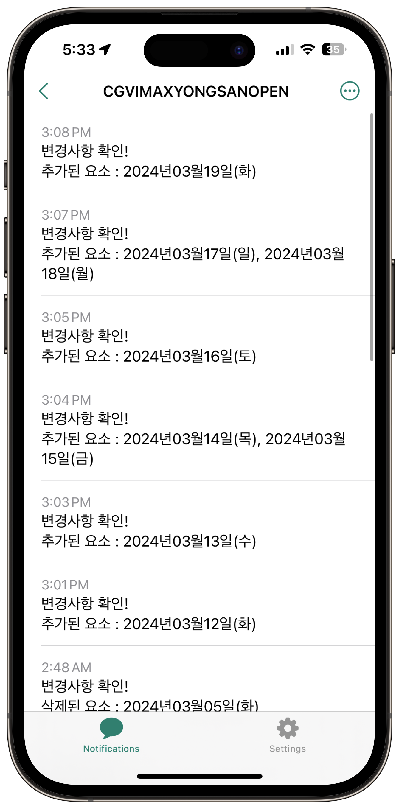

<div align="center">

# CGV 예매 오픈 알리미

<p align="center">
  
</p>

By_0w0i0n0g0

<br>
<br>

## 목차

[알림 받기](#알림-받기)

[Description](#description)

[Features](#features)

[Stack](#stack)

[License](#license)

</div>

<br>
<br>

## 🔎 현재 예매 오픈 알리미가 지켜보고 있는 영화는?

- 듄-파트2 / 용산아이파크몰 / IMAX관

<br>
<br>

## 알림 받기

<br>

### 1. 먼저 ntfy 앱을 다운받으세요.

[구글 플레이스토어](https://play.google.com/store/apps/details?id=io.heckel.ntfy)

[애플 앱스토어](https://apps.apple.com/us/app/ntfy/id1625396347)

당연히 예매 오픈 알림을 받으려면 설정에서 앱 알림을 켜줘야겠죠? 😉

<br>

### 2. 구독 추가

다음과 같이 Topic name에 밑의 리스트 중에서 골라 입력해주세요.

<p align="center">
  
</p>

---

- 듄-파트2 / 용산아이파크몰 / IMAX관

  - ### ```DUNE-PART2-YONGSAN-IMAX```

(요청에 따라 더 추가될 예정입니다.)

---

다음과 같이 Use another server 활성화 후, Service URL에
### ```http://serverkorea.duckdns.org```
를 입력해주세요.

<p align="center">
  
</p>

<br>

#### 만약 오류메세지가 뜨면서 실패하게 된다면 1시간 이상 기다렸다가 다시 시도해주세요. 개인 서버이기 때문에 현실적으로 24시간 정상작동을 보장할 수 없습니다.

<br>

### 🎉 이제 다 끝났어요!

### 알람은 이렇게 와요.

<p align="center">
  
</p>

- 실제 테스트 서버에서 2024/03/06 수요일에  CGV 용산아이파크몰 IMAX관 듄 파트2 3주차 (2024/03/12 ~ 2024/03/19) 예매 오픈 당시 실시간으로 울린 알림이에요.

<br>
<br>

## Description

-

<br>
<br>

## Features

- 

<br>
<br>

## Stack

 

<br>
<br>

## License

**AGPL-3.0 license**

Read full license [here](https://github.com/0w0i0n0g0/cgv-open-push/blob/main/LICENSE).

logo image - 
<a href="https://kr.freepik.com/free-photo/3d-render-notification-bell-icon-new-email-message_34503708.htm#query=%EC%95%8C%EB%A6%BC%20%EC%95%84%EC%9D%B4%EC%BD%98&position=0&from_view=keyword&track=ais&uuid=0303dc60-e421-4177-8ab2-29b1326ae712">작가 upklyak</a> 출처 Freepik